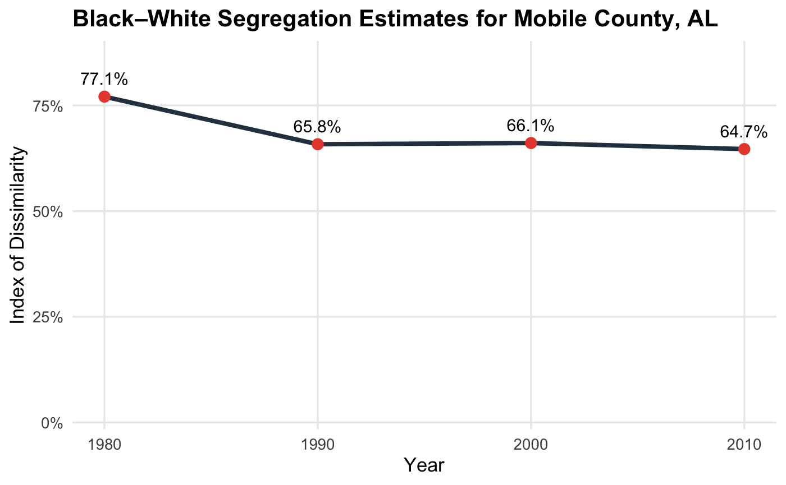

```{r setup, include=FALSE}
knitr::opts_chunk$set(
  echo = FALSE,
 # cache = FALSE,
  fig.width = 3,
  fig.height = 2,  
  fig.env="figure",
  dpi = 300
)

# Ensure required packages are installed and loaded
if (!requireNamespace("posterdown", quietly = TRUE)) {
  pak::pak("brentthorne/posterdown")
}
if (!requireNamespace("pagedown", quietly = TRUE)) {
  pak::pak("rstudio/pagedown")
}

library(tidycensus)
library(dplyr)
library(ggplot2)
library(sf)
library(viridis)
library(scales)
library(readr)

library(posterdown)
library(tidyverse)
library(ggplot2)
library(scales)
library(here)
here::i_am("howard-template.Rmd") # if you change the name of your file, update this
```

<style>
@page {
size: 48in 36in;
margin: 2in;
}
</style>

```{r, eval=F, include=FALSE}
# To render both HTML and PDF versions:
rmarkdown::render("howard-template.Rmd")

pagedown::chrome_print(
  "howard-template.html",
  output = "howard-template.pdf",
  options = list(
    paperWidth = 48, 
    paperHeight = 36
    )
)
```

# Abstract

This study analyzes demographic shifts in Mobile County, AL from 1960 to the present to assess the persistence of residential segregation. By utilizing decennial census data and spatial analysis, the research examines how structural and historical forces continue to drive spatial inequality in the post–civil rights era.

# Overview

**White Flight and Segregation**. White flight occurs when white individuals abandon integrated spaces to avoid growing minority populations and stall racial progress. This migration is driven by the desire to protect "whiteness as property," where distancing themselves from other races preserves their social and economic capital (Crowder & South, 2008). In Mobile, desegregation efforts were only made when they protected the elite’s economic interests and established new, spatial forms of white exclusivity (Bell, 1980).

**Segregation Facilitators**.

-   *Whiteness as property*: Whiteness is not just viewed as a racial identity, but as a legal and social asset that operates at a systems level. It posits that European ancestry carries a distinct set of inherent privileges, sociopolitical status, and expectations of entitlement that function as a protected form of property (Donner, 2021).
-   *Interest Convergence*: Racial equality is achieved when the interests of Black people align with the self-interests of a white majority (Bell, 1980).

# Literature Review

-   Between 1970-1980, Mobile County saw a significant decline in public school enrollment (approx. 11,500 students), directly correlating with a rise in private school attendance and suburban migration (Pride, 2022). This period highlights a distinct pattern of "white flight" from urban centers to suburban districts.

-   Research indicates that white residents often undervalue racially integrated areas due to an "aversion to living near black neighbors" and inflated perceptions of crime (Crowder & South, 2008). These subjective assessments frequently override objective neighborhood quality, driving residential turnover.

## Historical Evolution of Racial Categories

Before 1950, racial classification was determined by census enumerators using externally imposed categories rooted in "color," ancestry, and racial hierarchy (e.g., White, Black, Mulatto). These systems reflected the “one-drop rule” and did not rely on self-identification.

| Decade | Enumeration Method | Key Changes Relevant to Study |
|--------|------------------|-------------------------------|
| 1950   | Enumerator       | Race assigned by enumerators; “Negro” used; no “Black” category |
| 1960   | Mixed (Enumerator + Self-ID) | Transitional system; partial shift toward self-identification |
| 1970   | Self-identification | First full use of self-identification; “Black” reintroduced |
| 1980   | Self-identification | Expanded racial categories; terminology reordered (“Black or Negro”) |
| 1990   | Self-identification | “Race” replaces “Color or Race”; Asian/Pacific categories grouped |
| 2000   | Self-identification (multi-race allowed) | Respondents can select multiple races; “African American” added |
| 2010   | Self-identification (multi-race) | Same categories as 2000; clarified race vs. Hispanic origin |

Because racial classification methods and terminology changed over time—particularly the shift from enumerator-assigned race to self-identification—this study standardizes categories into “Black” and “White” to enable longitudinal comparison across census decades.

# Research Questions

*How have Black and white racial demographics across tracts in Mobile County evolved from 1980-2020?*

## Model

\[
D = \frac{1}{2} \sum_{i=1}^{n} \left| \frac{b_i}{B} - \frac{w_i}{W} \right|
\]

## Hypothesis

Levels of residential segregation will remain persistently high, reflecting the continued influence of structural factors such as white flight and path-dependent patterns of residential sorting.

# Methods and Data

This study uses historical census data from the U.S. Census Bureau to examine changes in Black and white residential distribution across census tracts in Mobile County from 1960 to 2010. Data are analyzed using spatiotemporal demographic mapping, involving longitudinal comparison of tract-level racial composition and the calculation of segregation indices across decennial census years. Our interpretation of observed trends is informed by a Critical Race Theory framework, particularly the concepts of interest convergence and whiteness as property, to contextualize segregation patterns over time.

# Findings

{width=90%}

```{r, include=F, warning=F, messages=F}
library(tidycensus)
library(dplyr)
library(sf)
library(ggplot2)
library(viridis)

options(tigris_use_cache = TRUE)

race_2020 <- get_acs(
  geography = "tract",
  state = "AL",
  county = "Mobile",
  year = 2020,
  variables = c(
    total = "B02001_001",
    white = "B02001_002",
    black = "B02001_003"
  ),
  geometry = TRUE
) %>%
  select(GEOID, variable, estimate, geometry) %>%
  tidyr::pivot_wider(names_from = variable, values_from = estimate) %>%
  mutate(
    pct_black = black / total
  )
```

```{r, include=F, warning=F, messages=F}
ggplot(race_2020) +
  geom_sf(aes(fill = pct_black), color = NA) +
  scale_fill_viridis_c(
    option = "magma",
    labels = scales::percent_format(accuracy = 1)
  ) +
  labs(
    title = "Black Population Share by Census Tract (Mobile County, 2020)",
    fill = "% Black"
  ) +
  theme_minimal(base_size = 13) +
  theme(
    axis.text = element_blank(),
    axis.title = element_blank(),
    panel.grid = element_blank()
  )
```

```{r, include=F, message=F, warning=F}
library(dplyr)

seg_2020 <- race_2020 %>%
  mutate(
    white = white,
    black = black
  )

B <- sum(seg_2020$black, na.rm = TRUE)
W <- sum(seg_2020$white, na.rm = TRUE)

d_2020 <- seg_2020 %>%
  mutate(
    black_share = black / B,
    white_share = white / W,
    diff = abs(black_share - white_share)
  ) %>%
  summarise(D = 0.5 * sum(diff, na.rm = TRUE))

d_2020

d_value <- d_2020$D
```

```{r, message=F, warning=F}
ggplot(race_2020) +
  geom_sf(aes(fill = pct_black), color = NA) +
  scale_fill_viridis_c(
  option = "magma",
  labels = scales::percent_format(accuracy = 1),
  guide = guide_colorbar(
    barwidth = 0.7,
    barheight = 6
  )
) +
  labs(
    title = "Mobile County, AL (2020)",
    subtitle = paste0("Index of Dissimilarity = ", round(d_value, 3)),
    fill = "% Black"
  ) +
  theme_minimal() +
  theme(
    axis.text = element_blank(),
    axis.title = element_blank()
  )
```


```{r}


```


# Discussion

# Conclusion

# Acknowledgements

This work was supported by funding from the Alfred P. Sloan Foundation (Grant 2023-21062).

# References

Crowder, K., & South, S. J. (2008). Spatial dynamics of white flight: The effects of local and extralocal racial conditions on neighborhood out-migration. American sociological review, 73(5), 792-812.

Donnor, J. K. (2021). White fear, White flight, the rules of racial standing and whiteness as property: Why two critical race theory constructs are better than one. Educational Policy, 35(2), 259-273.

Pride, R. A. (2002). The political use of racial narratives: School desegregation in Mobile, Alabama, 1954-97. University of Illinois Press.
